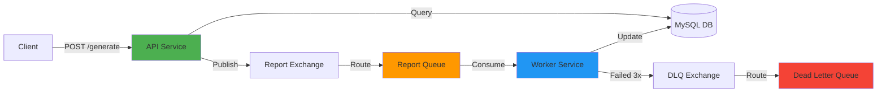

# 🚀 Async Report Generation Service

A production-ready backend service for generating complex reports asynchronously using event-driven architecture. This project demonstrates enterprise-grade patterns including message queuing, dead-letter queues (DLQ), retry mechanisms, and comprehensive error handling.

## 📋 Table of Contents

- [Features](#-features)
- [Architecture](#-architecture)
- [Tech Stack](#-tech-stack)
- [Prerequisites](#-prerequisites)
- [Quick Start](#-quick-start)
- [API Documentation](#-api-documentation)
- [Project Structure](#-project-structure)
- [Configuration](#-configuration)
- [Testing](#-testing)
- [Monitoring](#-monitoring)
- [Troubleshooting](#-troubleshooting)
- [Screenshots](#-screenshots)

## ✨ Features

- **Asynchronous Processing**: Offload heavy report generation to background workers
- **Message Queue Integration**: RabbitMQ with durable queues and persistent messages
- **Retry Mechanism**: Automatic retry with configurable attempts (default: 3)
- **Dead-Letter Queue (DLQ)**: Failed messages automatically routed to DLQ for inspection
- **Status Tracking**: Real-time report status via REST API
- **Health Checks**: Automated health monitoring for all services
- **Docker Support**: Complete containerization with Docker Compose
- **Production Ready**: Comprehensive error handling, logging, and resilience patterns
- **Test Coverage**: Unit and integration tests included

## 🏗️ Architecture



### Architecture Flow

1. **Client Request**: Client sends report generation request to API
2. **Immediate Response**: API validates request, creates database entry, publishes to RabbitMQ, returns 202 Accepted
3. **Message Routing**: RabbitMQ routes message from exchange to report queue
4. **Worker Consumption**: Worker consumes message and begins processing
5. **Processing**: Worker simulates 5-10 second report generation
6. **Status Update**: Upon completion, worker updates database with generated URL
7. **Retry Logic**: On failure, message is retried up to 3 times
8. **DLQ Routing**: After max retries, message moves to Dead-Letter Queue

## 🛠️ Tech Stack

- **Runtime**: Node.js 20 (Alpine Linux)
- **Framework**: Express.js
- **Message Broker**: RabbitMQ 3 (with Management UI)
- **Database**: MySQL 8.0
- **Containerization**: Docker & Docker Compose
- **Testing**: Jest, Supertest
- **Dependencies**: amqplib, mysql2, uuid, dotenv

## 📦 Prerequisites

- Docker Desktop (Windows/Mac) or Docker Engine + Docker Compose (Linux)
- Git
- Minimum 4GB RAM allocated to Docker
- Ports available: 3000 (API), 5672 (RabbitMQ), 15672 (RabbitMQ UI), 3306 (MySQL)

## 🚀 Quick Start

### 1. Clone the Repository

```bash
git clone https://github.com/saisuryavinay/async-report-service.git
cd async-report-service
```

### 2. Configure Environment

```bash
cp .env.example .env
# Edit .env if needed (optional for local development)
```

### 3. Build and Start Services

```bash
# Build all Docker images
docker-compose build

# Start all services in detached mode
docker-compose up -d

# Verify all services are healthy
docker-compose ps
```

### 4. Wait for Services to be Ready

```bash
# Monitor logs until all services are healthy
docker-compose logs -f

# Expected output:
# ✅ Connected to MySQL Database
# ✅ Connected to RabbitMQ
# ✅ Worker is waiting for messages...
# API Service running on port 3000
```

### 5. Test the Service

**Generate a Report:**

```bash
curl -X POST http://localhost:3000/api/reports/generate \
  -H "Content-Type: application/json" \
  -d '{
    "report_type": "sales_summary",
    "parameters": {
      "startDate": "2023-01-01",
      "endDate": "2023-03-31",
      "region": "EMEA"
    }
  }'
```

**Response:**

```json
{
  "report_id": "d290f1ee-6c54-4b01-90e6-d701748f0851",
  "status": "pending",
  "message": "Report generation initiated."
}
```

**Check Report Status:**

```bash
curl http://localhost:3000/api/reports/d290f1ee-6c54-4b01-90e6-d701748f0851/status
```

**Response:**

```json
{
  "report_id": "d290f1ee-6c54-4b01-90e6-d701748f0851",
  "status": "completed",
  "generated_url": "http://reports.example.com/d290f1ee-6c54-4b01-90e6-d701748f0851.pdf",
  "failure_reason": null,
  "retry_count": 0
}
```

## 📚 API Documentation

### POST /api/reports/generate

Initiates asynchronous report generation.

**Request Body:**

```json
{
  "report_type": "sales_summary",
  "parameters": {
    "startDate": "2023-01-01",
    "endDate": "2023-03-31",
    "region": "EMEA"
  }
}
```

**Fields:**
- `report_type` (string, required): Type of report to generate
- `parameters` (object, optional): Report-specific parameters

**Response: 202 Accepted**

```json
{
  "report_id": "d290f1ee-6c54-4b01-90e6-d701748f0851",
  "status": "pending",
  "message": "Report generation initiated."
}
```

**Error Responses:**
- `400 Bad Request`: Invalid input (missing report_type)
- `500 Internal Server Error`: Database or RabbitMQ error

---

### GET /api/reports/:id/status

Retrieves current status of a report.

**URL Parameters:**
- `id` (UUID v4): The report_id returned from generate endpoint

**Response: 200 OK**

```json
{
  "report_id": "d290f1ee-6c54-4b01-90e6-d701748f0851",
  "status": "completed",
  "generated_url": "http://reports.example.com/d290f1ee-6c54-4b01-90e6-d701748f0851.pdf",
  "failure_reason": null,
  "retry_count": 0
}
```

**Status Values:**
- `pending`: Report queued, not yet processed
- `processing`: Worker currently generating report
- `completed`: Report successfully generated
- `failed`: Report failed after all retries

**Error Responses:**
- `400 Bad Request`: Invalid UUID format
- `404 Not Found`: Report ID does not exist
- `500 Internal Server Error`: Database error

---

### GET /health

Health check endpoint for API service.

**Response: 200 OK**

```json
{
  "status": "API is healthy"
}
```

## 📁 Project Structure

```
async-report-service/
├── src/
│   ├── api/
│   │   ├── app.js                    # Express application entry point
│   │   ├── controllers/
│   │   │   └── reportsController.js  # API endpoint logic
│   │   └── routes/
│   │       └── reports.js            # Route definitions
│   ├── worker/
│   │   ├── worker.js                 # Worker service main logic
│   │   └── services/
│   │       └── reportService.js      # Report generation business logic
│   ├── config/
│   │   ├── db.js                     # MySQL connection setup
│   │   └── rabbitmq.js               # RabbitMQ connection and setup
│   └── database/
│       └── schema.sql                # Database initialization script
├── tests/
│   ├── unit/
│   │   ├── api.test.js               # API unit tests
│   │   └── worker.test.js            # Worker unit tests
│   └── integration/
│       └── api.integration.test.js   # End-to-end integration tests
├── docker-compose.yml                # Docker Compose orchestration
├── Dockerfile.api                    # API service Docker image
├── Dockerfile.worker                 # Worker service Docker image
├── package.json                      # Node.js dependencies
├── .env.example                      # Environment variables template
└── README.md                         # This file
```

## ⚙️ Configuration

### Environment Variables

All configuration is managed via environment variables. See [.env.example](.env.example) for complete list.

**Key Variables:**

| Variable | Description | Default |
|----------|-------------|---------|
| `PORT` | API service port | `3000` |
| `DB_HOST` | MySQL host | `localhost` |
| `DB_USER` | MySQL username | `root` |
| `DB_PASSWORD` | MySQL password | `root_password` |
| `DB_NAME` | MySQL database name | `reports_db` |
| `RABBITMQ_HOST` | RabbitMQ host | `localhost` |
| `RABBITMQ_USER` | RabbitMQ username | `user` |
| `RABBITMQ_PASS` | RabbitMQ password | `password` |
| `RABBITMQ_QUEUE` | Main queue name | `report_queue` |
| `RABBITMQ_EXCHANGE` | Main exchange name | `report_exchange` |
| `RABBITMQ_DLQ_QUEUE` | Dead-letter queue name | `report_dlq` |
| `MAX_RETRIES` | Maximum retry attempts | `3` |

### Database Schema

The reports table automatically created on first startup:

```sql
CREATE TABLE reports (
    id VARCHAR(36) PRIMARY KEY,
    report_type VARCHAR(100) NOT NULL,
    request_payload JSON NOT NULL,
    status VARCHAR(20) NOT NULL DEFAULT 'pending',
    generated_url VARCHAR(255) DEFAULT NULL,
    created_at TIMESTAMP DEFAULT CURRENT_TIMESTAMP,
    updated_at TIMESTAMP DEFAULT CURRENT_TIMESTAMP ON UPDATE CURRENT_TIMESTAMP,
    failure_reason TEXT DEFAULT NULL,
    retry_count INT NOT NULL DEFAULT 0,
    INDEX idx_status (status),
    INDEX idx_created_at (created_at)
);
```

### RabbitMQ Configuration

**Exchanges:**
- `report_exchange` (direct): Main exchange for routing report messages
- `dlq_exchange` (direct): Dead-letter exchange for failed messages

**Queues:**
- `report_queue`: Main processing queue with DLX configuration
- `report_dlq`: Dead-letter queue for permanently failed messages

**Bindings:**
- `report_exchange` → `report_queue` (routing key: `report_key`)
- `dlq_exchange` → `report_dlq` (routing key: `report_dlq_key`)

## 🧪 Testing

### Run Unit Tests

```bash
# Inside api-service container
docker-compose exec api-service npm test

# Or locally if Node.js installed
npm test
```

### Run Integration Tests

```bash
# Ensure all services are running
docker-compose up -d

# Run integration tests
npm run test:integration
```

### Test Coverage

```bash
npm test -- --coverage
```

### Manual Testing with cURL

**Create Multiple Reports:**

```bash
for i in {1..5}; do
  curl -X POST http://localhost:3000/api/reports/generate \
    -H "Content-Type: application/json" \
    -d "{\"report_type\": \"test_report_$i\", \"parameters\": {\"index\": $i}}"
  echo ""
done
```

**Monitor Worker Logs:**

```bash
docker-compose logs -f worker-service
```

## 📊 Monitoring

### RabbitMQ Management UI

Access at: http://localhost:15672

**Credentials:**
- Username: `user`
- Password: `password`

**Features:**
- View queue depth and message rates
- Inspect messages in queues
- Monitor DLQ for failed messages
- View exchange bindings

### Database Inspection

```bash
# Connect to MySQL
docker-compose exec db mysql -u root -proot_password reports_db

# View all reports
SELECT id, report_type, status, retry_count, created_at FROM reports;

# View failed reports
SELECT * FROM reports WHERE status = 'failed';

# Count reports by status
SELECT status, COUNT(*) as count FROM reports GROUP BY status;
```

### Service Logs

```bash
# All services
docker-compose logs -f

# Specific service
docker-compose logs -f api-service
docker-compose logs -f worker-service
docker-compose logs -f rabbitmq
docker-compose logs -f db
```

### Health Checks

```bash
# Check all service health
docker-compose ps

# API health endpoint
curl http://localhost:3000/health

# Check RabbitMQ
docker-compose exec rabbitmq rabbitmq-diagnostics ping
```

## 🔧 Troubleshooting

### Services Won't Start

**Issue**: Services fail health checks or won't start

**Solutions:**
```bash
# Check logs for errors
docker-compose logs

# Rebuild images
docker-compose down
docker-compose build --no-cache
docker-compose up -d

# Check port conflicts
netstat -ano | findstr "3000 5672 3306 15672"  # Windows
lsof -i :3000,5672,3306,15672                  # Linux/Mac
```

### Database Connection Errors

**Issue**: API can't connect to MySQL

**Solutions:**
```bash
# Verify MySQL is running
docker-compose ps db

# Check MySQL logs
docker-compose logs db

# Verify environment variables
docker-compose exec api-service env | grep DB_
```

### Messages Not Being Processed

**Issue**: Reports stuck in 'pending' status

**Solutions:**
```bash
# Check worker logs
docker-compose logs worker-service

# Verify RabbitMQ connection
docker-compose exec worker-service env | grep RABBITMQ_

# Check queue depth in RabbitMQ UI
# http://localhost:15672 → Queues → report_queue
```

### Failed Reports

**Issue**: Reports failing immediately or after retries

**Solutions:**
- Check worker logs for error details
- View failure_reason in database
- Inspect messages in DLQ via RabbitMQ UI
- Reduce failure simulation rate in worker.js (line causing random errors)

## 📸 Screenshots

### 1. Successful Report Generation


### 2. RabbitMQ Management UI


### 3. Database Status


### 4. Worker Processing Logs


## 🎥 Video Demonstration

[Watch 3-minute demo video](docs/demo-video.mp4)

## 🔗 Additional Resources

- [RabbitMQ Documentation](https://www.rabbitmq.com/documentation.html)
- [MySQL Documentation](https://dev.mysql.com/doc/)
- [Docker Compose Documentation](https://docs.docker.com/compose/)
- [Express.js Guide](https://expressjs.com/en/guide/routing.html)

## 📝 License

ISC

## 👤 Author

**Sai Surya Vinay**
- GitHub: [@saisuryavinay](https://github.com/saisuryavinay)
- Repository: [async-report-service](https://github.com/saisuryavinay/async-report-service)

## 🙏 Acknowledgments

This project demonstrates enterprise-grade backend patterns for asynchronous processing, message queuing, and resilient system design.
